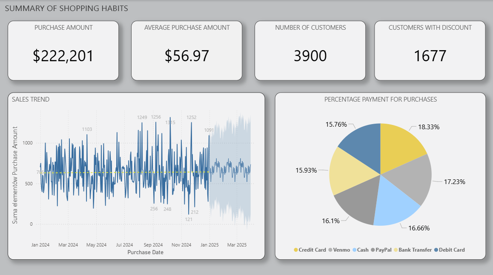
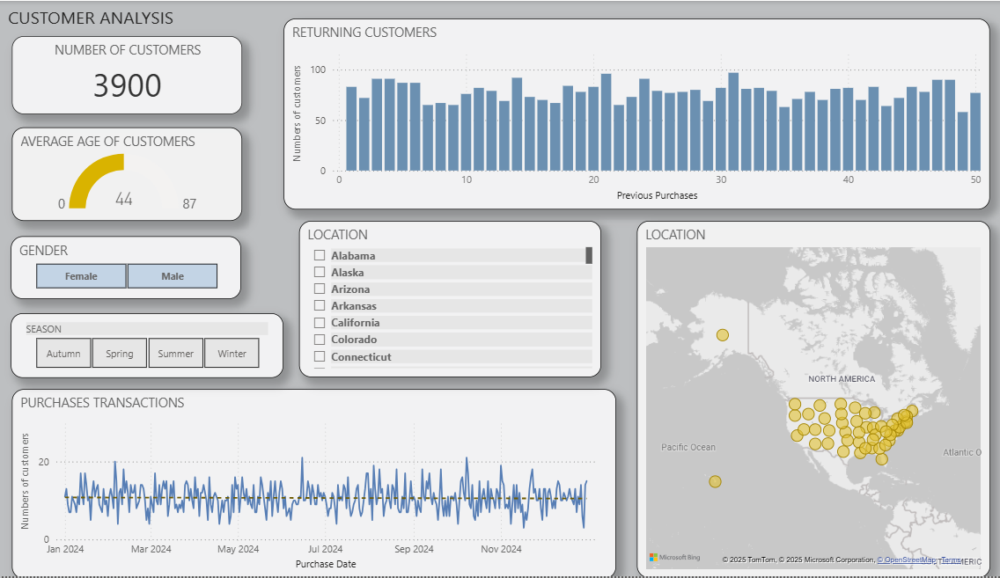
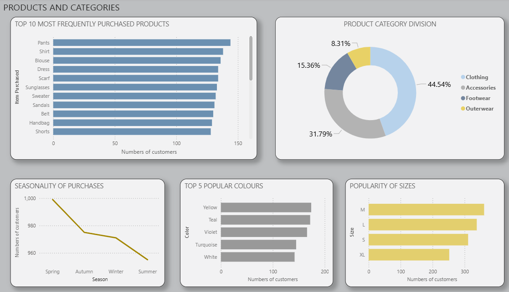
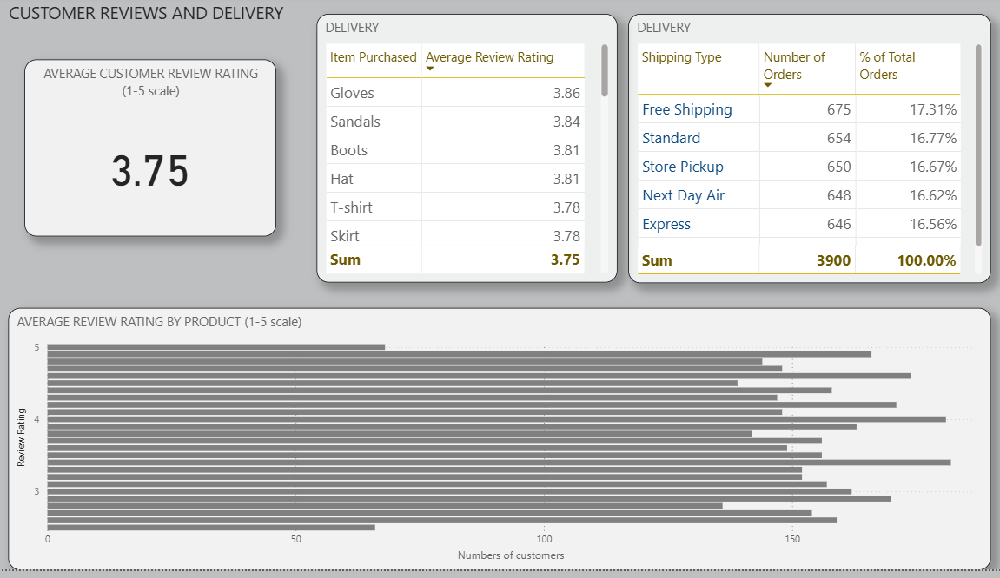

# Consumer Behaviour and Shopping Habits – Power BI

## Project Overview

This project demonstrates how Power BI can be used to analyse customer purchasing behaviour and translate transactional data into clear, business-focused insights.

Using a realistic consumer shopping dataset, the analysis explores sales structure across products and categories, the impact of discounts and subscriptions, customer review patterns, and delivery preferences.

The focus was on analytical clarity, appropriate metric selection, and building an intuitive report structure rather than maximising the number of visuals.

Data preparation was handled in Power Query, followed by a relational data model designed to support cross-dimensional analysis across customers, products, time, and delivery methods.

The final report is designed for non-technical stakeholders to support discussions around customer behaviour, promotional effectiveness, and purchasing patterns.

---

## Data Source

The dataset used in this project comes from **Kaggle** and represents consumer shopping behaviour, including:
- customer demographics,
- purchase history,
- product and category data,
- discounts and promotions,
- payment methods,
- delivery types,
- customer review ratings.

---

### Data preparation (Power Query)

The dataset was cleaned and prepared using Power Query before building the data model and visualisations.

Applied transformations included:
- renaming columns
- changing data types
- filtering rows
- handling missing values
- creating calculated columns

Power Query transformations were applied to the following queries:
- [shopping_trends](power_query/shopping_trends.png)
- [shopping_trends (continued)](power_query/shopping_trends2.png)
- [shopping_behaviour_updated](power_query/shopping_behaviour_updated.png)

---

## Data Model

A relational data model was created to support accurate filtering and aggregation across the report.

The model includes:
- transactional and behavioural tables,
- a calendar table for time-based analysis,
- one-to-many relationships following best practices.

---

## Dashboard Pages

The report consists of five dashboard pages:

### 1. Summary
High-level overview of sales value, average purchase amount, number of customers, payment methods, and overall trends.

---

### 2. Customer Analysis
Customer demographics, returning customers, purchase frequency, seasonality, and geographic distribution.

---

### 3. Products and Categories
Most frequently purchased products, category split, product colours, sizes, and seasonality.

---

### 4. Special Offers and Discounts
Analysis of discounts, promotional codes, subscription impact, and comparison of discounted vs non-discounted purchases.

---

### 5. Customer Reviews and Delivery
Customer review ratings (1-5 scale), product-level review performance, and delivery method analysis.

---

## Key Insights

- Customer review ratings vary by product and delivery method.
- A small number of product categories generate the majority of purchases.
- Discounts and promotions have a measurable impact on purchasing behaviour.
- Free and standard shipping account for the largest share of orders.
- Returning customers show stable purchasing patterns over time.

---

## Tools Used

- Power BI Desktop  
- Power Query  
- DAX  
- Kaggle dataset  
- GitHub

